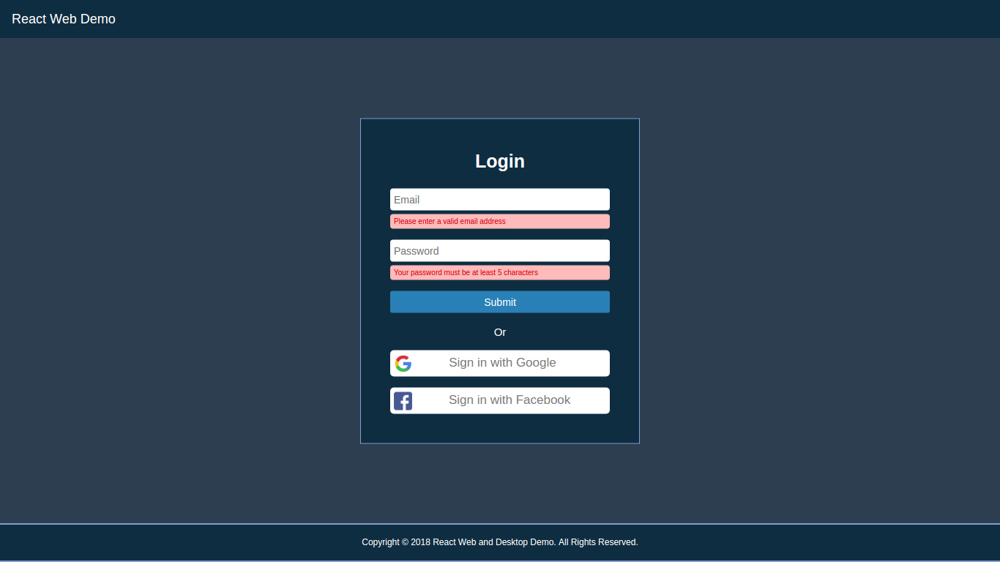
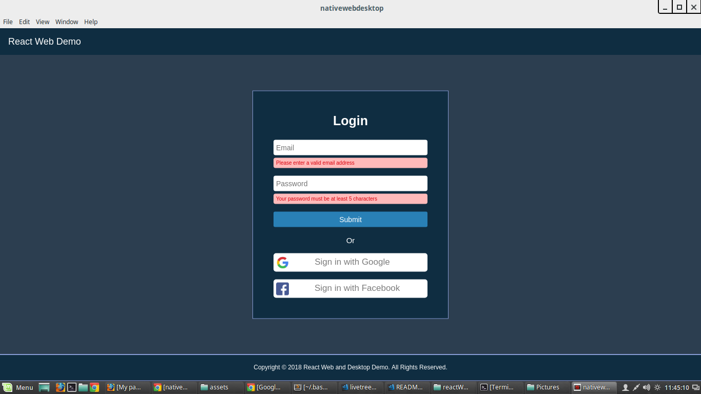

# react js starter
Project for platform (Web and Desktop(Mac., Linux, and Windows))

A way to share application logic between a React Web app and React Desktop app with a single set of code. The app includes user authentication (auth2 authentication), social authentication (Google and Facebook), Google analytics, Routing (Conditional), API calling, UI Components (header, footer, home page, side navigation)

-react-native-web with webpack is used for building web specific app
-electron with webpack is used for building desktop specific app
-electron packeger for generating distributable desktop file

## Directory structure:

web houses the web project files including index.html, bundle.js and wevpack files, desktop houses the main.js and index.html also minified bundle.js  needed for the electron, and web houses the webpack configs and index.html minified bundle.js.

## Entry point:

The entry point for the web and desktop app is index.web.js.

## Environment setup and Running the application:

- install node -- v8.9.3
- install npm -- v5.5.1 or yarn -- v1.3.2
- install electron globally -- v1.7.10

### clone or download zip

```
git clone https://github.com/aspiresoftware/reactNative.git projectname
cd projectname
yarn or npm install
```

After installing whole lot of things you can run your application.

scripts are defined in package.json file for each specific file
just run in terminal

### For web
- `yarn run run-web` your app is accessible at `http://localhost:3000`
- `yarn run prod-web` --> for production build

### For desktop
`yarn run run-desktop` (Linux, windows, and mac os)

### Building distributable package for desktop
- `yarn run pack-linux` -> to get ditributable package for linux
- `yarn run pack-windows` -> to get ditributable package for windows
- `yarn run pack-mac` -> to get ditributable package for mac

## Screen shots

### Web


### Desktop


## For more information and help visit

- [React Native Web](https://github.com/necolas/react-native-web)
- [Electron](https://electronjs.org/)
- [Electron Packeger](https://www.npmjs.com/package/electron-packager)

## Problems

Currently social authentication is not working for desktop app, so dont mind if it throws error.